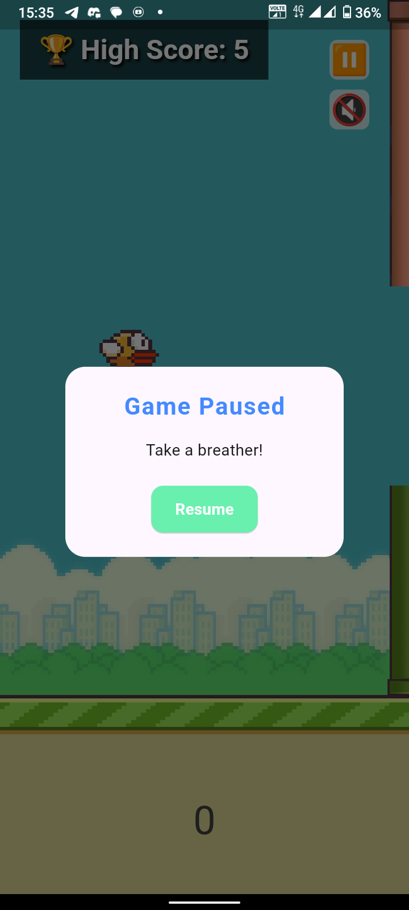
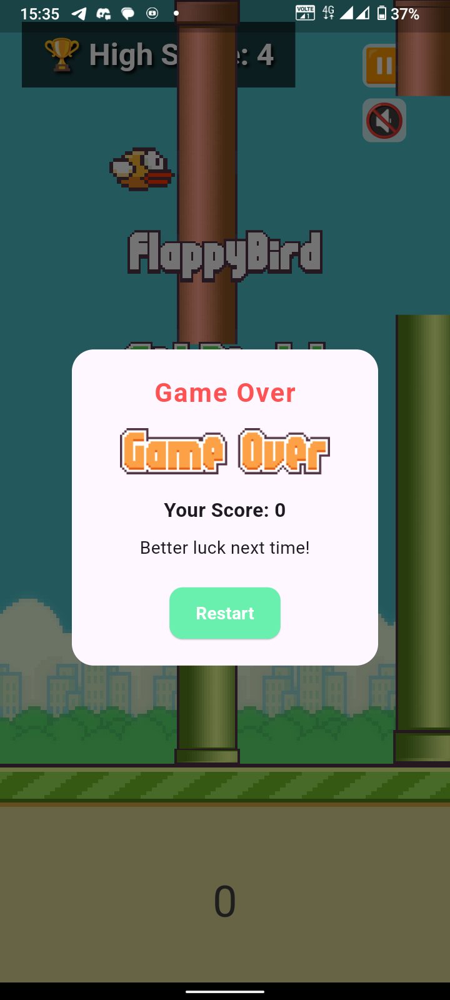
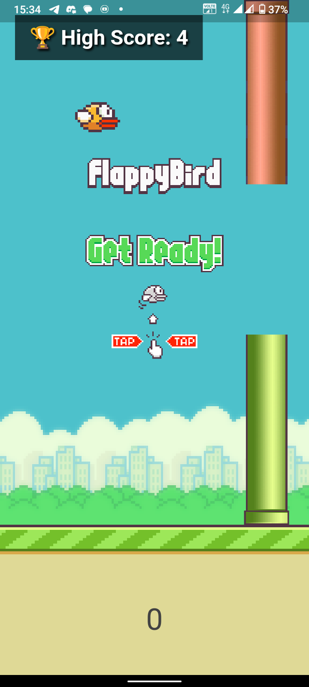

# flappygame

A replica of the famous Flappy Bird

## About the Game

Flappygame is a simple, addictive, and fun game inspired by the classic Flappy Bird. Your goal is to navigate the bird through a series of obstacles by tapping the screen to keep it in the air. It offers endless gameplay and gradually increases in difficulty, keeping players engaged.

## Getting Started

This game has been built with **Flutter** and the **Flame game engine**, combining the power of Flutter's UI framework with the robust gaming capabilities of Flame.

## App Screenshots

  
  
  

